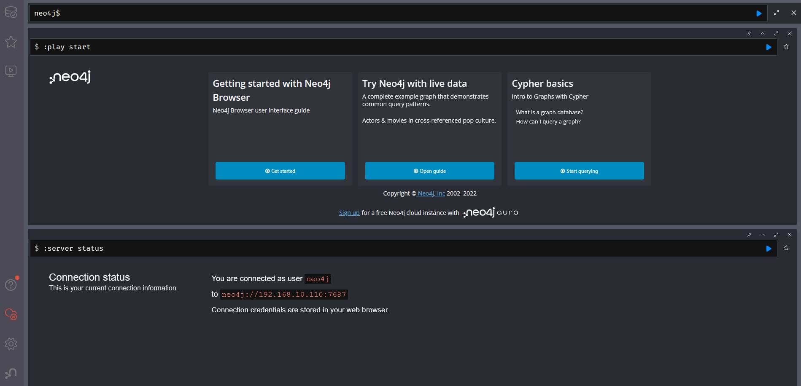
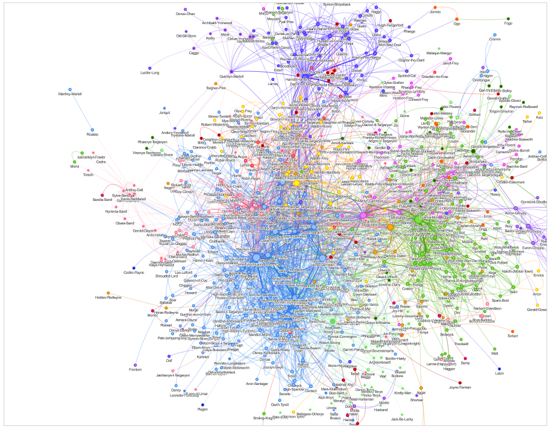

# neovis.js tutorial

This follows [official tutorial in README](https://github.com/neo4j-contrib/neovis.js)

## Usage

Change ip address in `static/index.html` from `192.168.10.110` to `<your ip address>` as from

```js
server_url: "bolt://192.168.10.110:7687",
```

to

```js
server_url: "bolt://<your ip address>:7687",
```

Then launch services.

```bash
$ docker-compose up -d
```

You can find neo4j gui in `http://<your ip address>:7474`.



Then insert fixture data.

```bash
$ cat start.cypher | docker-compose exec -T neo4j cypher-shell -u neo4j -p neo4j2
```

Finally you can find graph in `http://<your ip address>:8080`

